<!--  -->

@shaderqu  
👋 안녕하세요! 끈기있게 탐구하는 개발자, 성환입니다.  
> 게임 개발 제너럴리스트 Game Development Generalist  
> *Programming, Technical Art, Hardsurface Modeling*

<!-- ## ***Socials*** -->
<!--  -->
<!--  -->
<!--  -->

<!-- - [Linked In]   -->
<!-- - [Youtube]   -->

### Languages

<!--  -->
<!--  -->
<!--  -->
<!--  -->

  
  

<!-- C#, C++, Python, MaxScript, ActionScript, TypeScript.   -->

<!-- ## ***Repositories***
### Unity Plugins
- [Asset Lens] : 유니티 에셋 레퍼런스 트래킹 에디터 도구
- [Project Builder] : 프로젝트 배치 빌드 도구
- [Windows File Bridge] : 윈도우 탐색기 파일을 유니티 게임뷰로 드래그 앤 드랍 메시지 받기
- [ShaderGraph Key2Node] : 셰이더 그래프에서 키보드 단축키로 노드 생성 가능하게 해주는 확장
- [FormerlySerializedAsForShaderLab] : 셰이더 프로퍼티 이름 변경시 이전 이름으로 저장된 데이터를 가져와주는 도구
- [Whisper] : 키 값에 델리게이트를 저장하고 적은 비용으로 글로벌 호출이 가능 -->

<!-- 
#### WIP
- [DrawDebugHelper] : 게임뷰에서 디버깅용 프리미티브 메쉬를 그려주는 도구
- [BehaviorTreeGraph] : 런타임 에디팅을 지원하는 비헤이비어 트리 그래프

### Games (Private until release as open source)
- Auto Battler Framework
- Rhythm Game Framework
- Yahtzee Dice Framework 
-->
<!-- 
### Others
- [Open Include] - Unity SRP `#include` 파일을 열어주는 Visual Studio 플러그인   -->

[CV]: https://jeon.sh/CurriculumVitae
[Tistory]: https://tistory.jeon.sh/
[GitHub Pages]: https://blog.jeon.sh/
[Linked In]: https://www.linkedin.com/in/seonghwan-dev/
[Youtube]: https://www.youtube.com/channel/UCejzaM_RkykdoidzlPg-qCw/featured

[Asset Lens]: https://github.com/seonghwan-dev/AssetLens  
[DrawDebugHelper]: https://github.com/seonghwan-dev/DrawDebugHelper  
[Project Builder]: https://github.com/seonghwan-dev/Project-Builder
[Windows File Bridge]: https://github.com/DigitalLavender/WindowsUnityFileBridge
[ShaderGraph Key2Node]: https://github.com/seonghwan-dev/shadergraph-key2node
[FormerlySerializedAsForShaderLab]: https://github.com/seonghwan-dev/FormerlySerializedAsForShaderLab
[Whisper]: https://github.com/seonghwan-dev/Whisper
[BehaviorTreeGraph]: https://github.com/seonghwan-dev/BehaviorTreeGraph
[Open Include]: https://github.com/seonghwan-dev/OpenInclude
